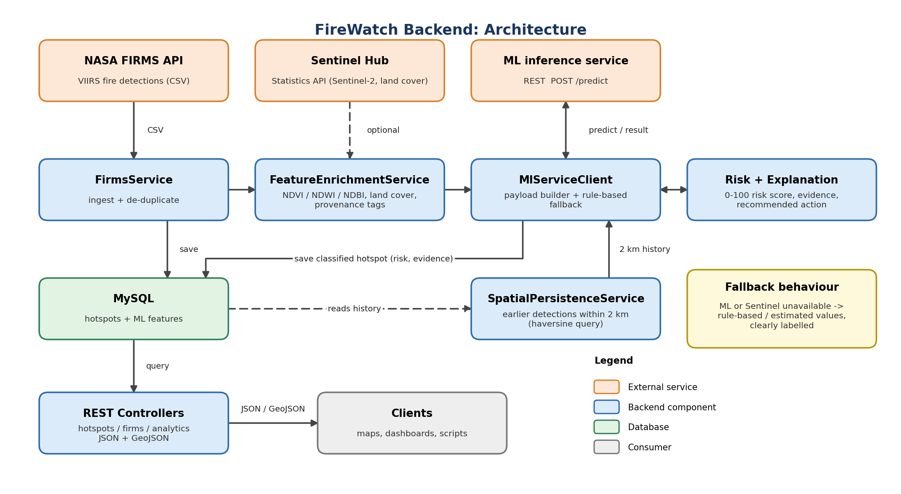

# FireWatch Backend

REST backend for a satellite-based thermal anomaly monitoring platform. It ingests NASA FIRMS fire detections, enriches them with Sentinel-2 and land-cover context, classifies them through an ML inference service, and scores each event for operational priority.

Built with **Java 25 · Spring Boot 4.1 · Spring Data JPA · MySQL**.

Originally developed for Smart India Hackathon 2026 (problem statement SIH26162: *AI-Based Detection and Classification of Industrial Fires and Persistent Thermal Sources*).

---

## The problem

Satellites detect heat from many sources: refinery flares, power plants, crop-residue fires and wildfires. Alerting on every detection overwhelms operators. This backend turns raw detections into **prioritised, explainable events** so a human knows what to look at first.

```
DETECT → ENRICH → CLASSIFY → SCORE RISK → EXPLAIN → RECOMMEND
```

## Features

- **FIRMS ingestion**: bounding-box queries against the NASA FIRMS CSV API (1–10 day window), CSV parsing, and duplicate detection on latitude, longitude, date, time and satellite.
- **Sentinel Hub enrichment**: NDVI, NDWI and NDBI from Sentinel-2 L2A (bands B03, B04, B08, B11) via the Statistics API, with `dataMask` pixel validation and a cloud-cover limit. Categorical land-cover classes are handled so that class codes are never averaged. OAuth tokens are cached until shortly before expiry.
- **Data provenance tracking**: every enriched feature is tagged `SENTINEL_DERIVED`, `COPERNICUS_DERIVED` or `FALLBACK_ESTIMATED`. Estimated values are never presented as real measurements.
- **Spatial persistence**: a haversine SQL query finds earlier detections within a 2 km radius. Detection count and distinct active days feed both classification and risk.
- **ML integration**: builds a structured payload (FIRMS data, satellite geometry, land cover, spectral features, 2 km history), calls the inference service over REST, and falls back to rule-based classification if the service is disabled or unreachable. Fallback results are labelled `RULE_BASED_FALLBACK` and carry no model probability.
- **Risk scoring**: a deterministic, configurable 0–100 score, kept separate from model confidence.
- **Explainability**: a human-readable evidence summary and recommended action for each hotspot.
- **GIS-ready output**: GeoJSON `FeatureCollection` endpoint for map libraries such as Leaflet, MapLibre and Mapbox.
- **Analytics**: summary KPIs and a ranked high-risk list.
- **Error handling**: a global exception handler returns consistent JSON errors.

## Architecture



### Classification output

| Classification | Meaning |
| :--- | :--- |
| `AGRICULTURAL_FIRE` | Crop-residue or stubble burning |
| `WILDFIRE` | Forest or vegetation fire |
| `INDUSTRIAL_FIRE` | Industrial thermal event |
| `PERSISTENT_INDUSTRIAL_SOURCE` | Industrial event with at least 3 earlier detections within 2 km, i.e. a recurring thermal pattern that may correspond to infrastructure such as flare stacks or power plants |

### Risk model

`Risk = 25% thermal intensity + 25% persistence + 20% built-up context + 20% detection and model evidence + 10% environmental context`

| Factor | Based on |
| :--- | :--- |
| Thermal intensity | Fire Radiative Power (FRP), plus a bonus for very high Ti4 brightness |
| Persistence | Detection count and active days in the 2 km area |
| Built-up context | NDBI |
| Detection and model evidence | Model probability if available; otherwise the NASA FIRMS detection confidence |
| Environmental context | NDVI, NDWI, bare-ground and grass fractions |

| Score | Level |
| :--- | :--- |
| 0–39 | `LOW` |
| 40–69 | `MODERATE` |
| 70–84 | `HIGH` |
| 85–100 | `CRITICAL` |

Weights are configurable through `firewatch.risk.weight.*` properties.

## API

Base URL: `http://localhost:8081/api`

### Hotspots

| Method | Endpoint | Description |
| :--- | :--- | :--- |
| `GET` | `/hotspots` | List and filter hotspots. Pagination applies when both `page` and `size` are given. |
| `GET` | `/hotspots/geojson` | Same filters, returned as a GeoJSON `FeatureCollection` |
| `GET` | `/hotspots/{id}` | Get one hotspot |
| `GET` | `/hotspots/{id}/ml-payload` | Inspect the exact payload sent to the ML service |
| `POST` | `/hotspots/{id}/classify` | Re-enrich, classify and score one hotspot |
| `POST` | `/hotspots/classify-all` | Classify all hotspots that have no classification yet |
| `POST` | `/hotspots` | Save a manual hotspot (it is enriched on save) |
| `DELETE` | `/hotspots/{id}` | Delete a hotspot |

Filter parameters: `minLat`, `maxLat`, `minLon`, `maxLon`, `startDate`, `endDate` (`YYYY-MM-DD`), `classification`, `minFrp`.

### FIRMS ingestion

| Method | Endpoint | Description |
| :--- | :--- | :--- |
| `GET` / `POST` | `/firms/hotspots`, `/firms/sync` | Fetch FIRMS detections for a bounding box, save new ones, enrich them and (optionally) classify them |

Parameters: `minLon`, `minLat`, `maxLon`, `maxLat` (required), `source` (default `VIIRS_SNPP_NRT`), `days` (1–10, default 5), `autoClassify` (default `true`).

### Analytics

| Method | Endpoint | Description |
| :--- | :--- | :--- |
| `GET` | `/analytics/summary` | Totals, classified and unclassified counts, high-risk and persistent counts, average and max FRP, counts per class |
| `GET` | `/analytics/high-risk?minFrp=100` | Hotspots above the FRP threshold or with a `HIGH` or `CRITICAL` risk level, sorted by risk |

### Errors

Errors return JSON with a `status` field:

| Status | Cause |
| :--- | :--- |
| `400` | Invalid argument or parameter type, such as an invalid bounding box or unknown hotspot ID |
| `404` | Resource not found |
| `409` | Illegal state, such as a missing FIRMS map key |
| `500` | Unexpected error |

### Example

```bash
# Ingest and classify 5 days of detections around Jamnagar
curl -X POST "http://localhost:8081/api/firms/sync?minLon=69.80&minLat=22.30&maxLon=70.30&maxLat=22.65&days=5"

# High-FRP detections as GeoJSON
curl "http://localhost:8081/api/hotspots/geojson?minFrp=50&startDate=2026-09-01"

# Dashboard summary
curl "http://localhost:8081/api/analytics/summary"
```

## Project structure

```
src/main/java/com/firewatch/firewatch_backend/
├── Controller/      Hotspot, FIRMS and analytics REST endpoints (plus a dev-only mock ML endpoint)
├── Service/         FIRMS ingestion, Sentinel Hub client, enrichment, persistence,
│                    ML client, risk scoring, explanations, GeoJSON, analytics
├── Entity/          Hotspot and MlFeature JPA entities
├── Respositry/      Spring Data repositories and the spatial SQL query
├── dto/             ML payload, GeoJSON and analytics DTOs
├── config/          CORS and RestTemplate configuration
└── exception/       Global exception handler
```

## Getting started

### Prerequisites

- JDK 25 (set in `pom.xml`)
- MySQL 8+ on `localhost:3306`
- A [NASA FIRMS MAP_KEY](https://firms.modaps.eosdis.nasa.gov/api/map_key/)
- Optional: Sentinel Hub OAuth client credentials
- Optional: an ML inference service exposing `POST /predict`

### Configuration

Set secrets as environment variables. Do not commit them.

| Variable | Purpose |
| :--- | :--- |
| `DB_USERNAME`, `DB_PASSWORD` | MySQL credentials |
| `NASA_FIRMS_MAP_KEY` | NASA FIRMS API key (required for ingestion) |
| `SENTINEL_HUB_CLIENT_ID`, `SENTINEL_HUB_CLIENT_SECRET` | Sentinel Hub credentials (optional) |

Key properties in `src/main/resources/application.properties`:

```properties
server.port=8081
satellite.api.enabled=true      # false = skip Sentinel Hub, use estimated features
ml.service.enabled=true         # false = always use rule-based classification
ml.service.url=http://localhost:8000/predict
```

The `firewatch` database is created automatically on first run (`createDatabaseIfNotExist=true`).

### Run

```bash
./mvnw spring-boot:run
```

The API is then available at `http://localhost:8081/api`.

The backend works without the optional services. With the ML service off, hotspots are classified by rules and labelled `RULE_BASED_FALLBACK`. With Sentinel Hub off or failing, features are estimated and labelled `FALLBACK_ESTIMATED`.

### Test

```bash
./mvnw test
```

The tests cover FIRMS CSV parsing, feature enrichment and its fallback behaviour, GeoJSON conversion, the Sentinel Hub client, and Spring context startup.

A mock ML endpoint (`POST /api/ml/mock-predict`) exists for local development only. It is active only under the `dev`, `test` or `mock` Spring profiles.

## Limitations

- **Latency:** FIRMS data reflects satellite overpass times and is typically available 1–3 hours after observation. This is not live video or instant alerting.
- **Cloud and smoke:** these can obscure thermal and optical observations.
- **Estimated features:** when Sentinel data is unavailable, spectral and land-cover values are estimated from VIIRS thermal bands. They are flagged `FALLBACK_ESTIMATED` and are not equivalent to direct measurements.
- **Persistence:** it measures spatial recurrence within a 2 km area, not proof of one identical physical source.
- **Decision support only:** this system prioritises events for human review. It does not dispatch responders or confirm incidents. High FRP indicates intense thermal emission, not proof of an accident.
- **No authentication layer:** intended to run on a trusted network.

## Author

**Ayush Thakur**: designed and built the backend.
[LinkedIn](https://www.linkedin.com/in/ayush-thakur-08a05138a) · [GitHub](https://github.com/ayushthakur2006-lgtm)
